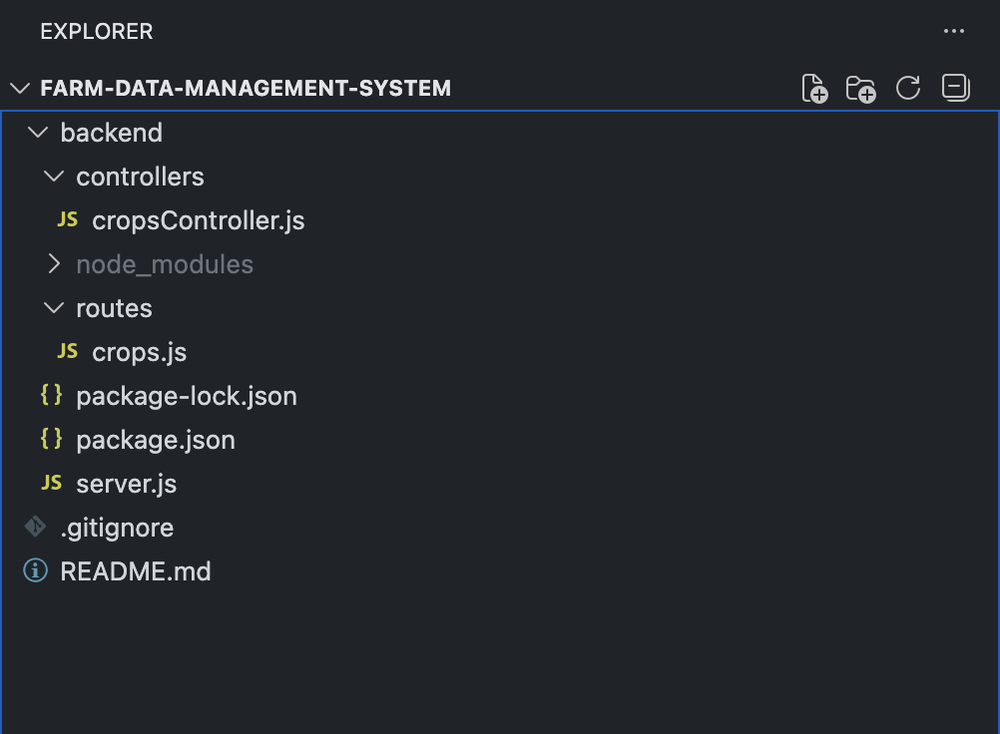
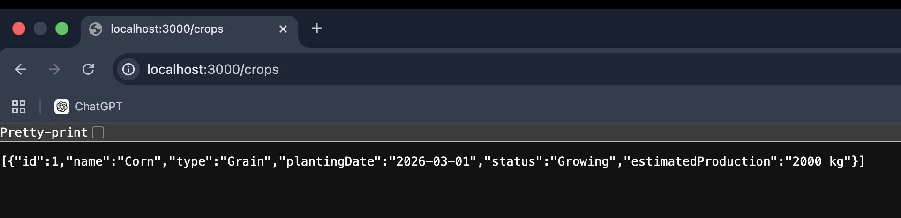
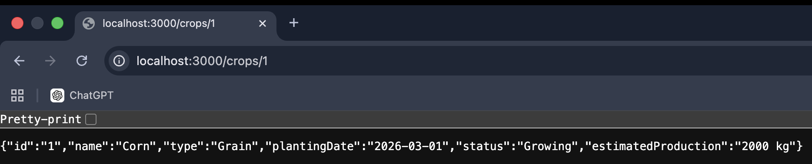
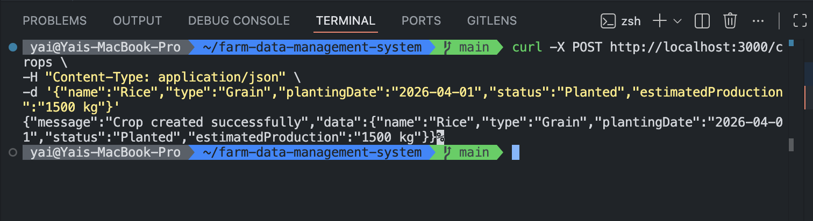
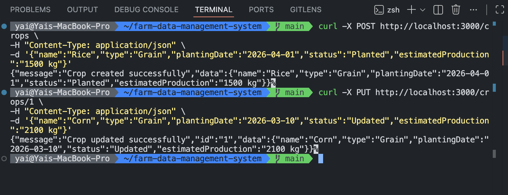
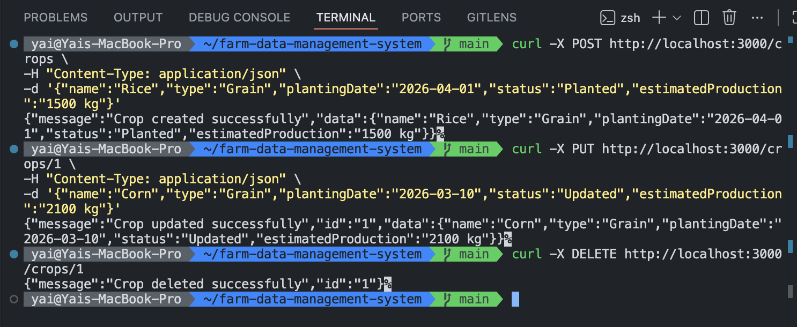

# 🌱 Farm Data Management System

A REST API for managing agricultural crop data.  
This project demonstrates a basic CRUD backend built with **Node.js** and **Express**.

---

# 🚀 Features

- Create crop records
- Retrieve all crops
- Retrieve a crop by ID
- Update crop data
- Delete crop records
- RESTful API structure using routes and controllers

---

# 🛠 Technologies

- Node.js
- Express.js
- REST API
- JavaScript
- Git & GitHub

---

# 📂 Project Structure



backend
├ controllers
│ └ cropsController.js
├ routes
│ └ crops.js
├ server.js
└ package.json

---

# 📡 API Endpoints

## Get all crops

GET `/crops`



---

## Get crop by ID

GET `/crops/:id`



---

## Create crop

POST `/crops`



---

## Update crop

PUT `/crops/:id`



---

## Delete crop

DELETE `/crops/:id`



---

# ▶️ Run the Project

Clone the repository
https://github.com/yailinpvdev/farm-data-management-system

Go to the project folder
cd farm-data-management-system/backend

Install dependencies
npm install

Run the server
node server.js

The server will run on:
http://localhost:3000/

---

# 📌 Example Crop Data

```json
{
  "name": "Corn",
  "type": "Grain",
  "plantingDate": "2026-03-01",
  "status": "Growing",
  "estimatedProduction": "2000 kg"
}


Author

Yailín Pérez
Software Developer in Training

GitHub
https://github.com/yailinpvdev


```
